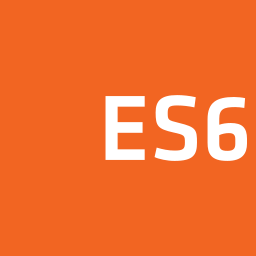
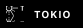

  
<!-- 标题 -->
<h2>Hello! I'm Allen, a full-stack development engineer </h2>
<!-- En / Zh -->
<a href="README(zh-cn).md"><picture>
<source media="(min-width: 768px) and (prefers-color-scheme: light)" srcset="./img/zh-black.svg">
<source media="(max-width: 768px) and (prefers-color-scheme: dark)" srcset="./img/zh-white.svg">
</picture></a>
<a href="README.md"><picture>
<source media="(min-width: 768px) and (prefers-color-scheme: light)" srcset="./img/en-black.svg">
<source media="(max-width: 768px) and (prefers-color-scheme: dark)" srcset="./img/en-white.svg">
</picture></a>
<!-- Count Of Profile View and Stars  -->
&nbsp;&nbsp;

 
 

<!-- My Info -->

<!-- <a> -->
<!--  -->
<!-- </a> -->

<!-- Stats of Generted from git-stats project -->
<a>
 <picture>
  <source media="(min-width: 768px) and (prefers-color-scheme: light)" srcset="https://raw.githubusercontent.com/yymm120/github-stats/refs/heads/master/generated/overview.svg">

  <source media="(max-width: 768px) and (prefers-color-scheme: dark)" srcset="https://raw.githubusercontent.com/yymm120/github-stats/refs/heads/master/generated/overview.svg#gh-dark-mode-only">

  
    </picture>
</a>

<h3> About me </h3>

- a passionate and learns every day full-stack developer.
- Currently learning Rust Application developmen.
- Currently looking for Rust development positions.

 

<!-- Tables -->
### The tools and languages ​​I liked most

<table>
  <tr>
    <td align="center" width="96">
      
       Rust
    </td>
    <td align="center" width="96">
      
       Javascript
    </td>
    <td align="center" width="96">
      
       Podman
    </td>
    <td align="center" width="96">
      
       TypeScript
    </td>
    <td align="center" width="96">
      
       Ubuntu
    </td>
    <td align="center" width="96"> 
      
       Postgres
    </td>
    <td align="center"  width="96">
      
       Figma
    </td>
    <td align="center" width="96">
      
       Photoshop
    </td>
  </tr>
</table>

<!-- Skills -->
### Skills
Program Languages

    
    
    

    
    
    

Database

    

Frameworks

<!--  -->

Package Manage Tools

Other Tools

    
    
    
 

<!-- Some Chart -->
<h3> Last 30 Days </h3>

<picture>
  <source media="(min-width: 768px) and (prefers-color-scheme: light)" srcset="https://github-readme-activity-graph.vercel.app/graph?username=yymm120&theme=github">

  <source media="(max-width: 768px) and (prefers-color-scheme: dark)" srcset="https://github-readme-activity-graph.vercel.app/graph?username=yymm120&theme=react-dark">

  
</picture>

<h3> Last Year </h3>

<!-- 
<picture>
  <source media="(min-width: 768px) and (prefers-color-scheme: light)" srcset="https://github-profile-summary-cards.vercel.app/api/cards/profile-details?username=yymm120&theme=github">

  <source media="(max-width: 768px) and (prefers-color-scheme: dark)" srcset="https://github-profile-summary-cards.vercel.app/api/cards/profile-details?username=yymm120&theme=github_dark">

  
</picture>
-->

<h3> Most Used Languages </h3>

<picture>
  <source media="(min-width: 768px) and (prefers-color-scheme: light)" srcset="https://raw.githubusercontent.com/yymm120/github-stats/refs/heads/master/generated/languages.svg">

  <source media="(max-width: 768px) and (prefers-color-scheme: dark)" srcset="https://raw.githubusercontent.com/yymm120/github-stats/refs/heads/master/generated/languages.svg#gh-dark-mode-only">

  
</picture>

 
 

<picture>
  <source media="(min-width: 768px) and (prefers-color-scheme: light)" srcset="https://github-readme-stats.vercel.app/api/top-langs/?username=yymm120">

  <source media="(max-width: 768px) and (prefers-color-scheme: dark)" srcset="https://github-readme-stats.vercel.app/api/top-langs/?username=yymm120&theme=dark">

  
</picture>

<!-- 

https://zxl19.github.io/github-profile/

标签
Shields.io
Simple Icons
996icu/996.ICU
badges/shields
simple-icons/simple-icons
othneildrew/Best-README-Template
alexandresanlim/Badges4-README.md-Profile
trekhleb/state-of-the-art-shitcode
antonkomarev/github-profile-views-counter
Aikoyori/ProgrammingVTuberLogos
gjbae1212/hit-counter
jwenjian/visitor-badge
a-maliarov/awesome-shields

统计信息
anuraghazra/github-readme-stats
abhisheknaiidu/awesome-github-profile-readme
tipsy/profile-summary-for-github
lowlighter/metrics
star-history/star-history
ryo-ma/github-profile-trophy
DenverCoder1/github-readme-streak-stats
durgeshsamariya/awesome-github-profile-readme-templates
yihong0618/running_page
vn7n24fzkq/github-profile-summary-cards
Ashutosh00710/github-readme-activity-graph
elangosundar/awesome-README-templates
yoshi389111/github-profile-3d-contrib
songquanpeng/stats-cards
zerosoul/github-star-stats
Star Charts
RevolverMaps
ClustrMaps
Free website hit counter
不蒜子-极简网页计数器

美化
fangpenlin/avataaars-generator
DenverCoder1/readme-typing-svg
github-contribution-grid-snake

参考
GitHub隐藏新功能！个人页还能这么玩？-GitHub Daily的文章-知乎
几条经验美化你的GitHub开源项目-简书
使用Gist让你的GitHub个人主页变酷-z2z23n0的文章-知乎
Github个人首页美化指北-AntzUhl的文章-知乎
GitHub上这款Q版头像生成器，快被网友玩坏了…-GitHub Daily的文章-知乎

 -->
