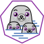

  
<h2>Hello! I'm Allen, a full-stack development engineer </h2>
&nbsp;&nbsp;

 

### About me 

- 一个充满热情的全栈开发人员.learning every day.
- 目前正在学习鸿蒙开发.
- 目前正在寻找鸿蒙开发相关的工作机会, 这是我的简历.
- 近期项目: 基于鸿蒙ArkUI开发的日程管理工具.

### 技能
- 编程语言: Javascript, Rust, Java

    
    
    

- 前端: Html5, Css, ES6, Typescript

    
    
    
    

- 数据库: Postgres, Redis

    
    

- 框架: Axum, ArkUI, NextJs

    
    
    

- 包管理: Npm, Bun.js, Cargo

    
    

- 工具: Git, Linux, Podman

    
    
    
- 
Things I code with
Typescript
Hormony
Podman
Github Actions
Typescript
Rust
Javascript
NPM
NextJs
Rollup
HTML5
Bun.js
MongoDB
Postgres
Axum

Github统计数据

My latest posts

